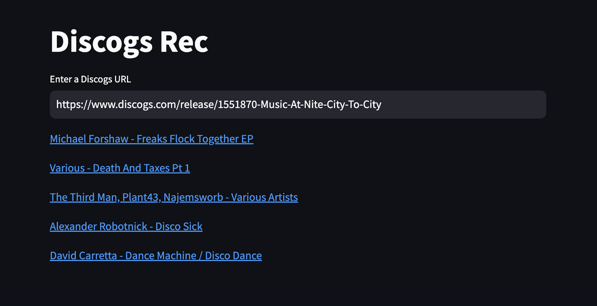

# Discogs Rec
Discogs Rec is a recommender system designed to enhance the Discogs digging experience by allowing users to input URLs of releases that they were interested in and receive the top N recommendations back, in order to aid in discovering new music that they might not have discovered on their own. It utilizes Spotify's [Annoy](https://github.com/spotify/annoy) library and is trained on data from the Discogs data dumps, as well as additional data such as user wants, haves, and pricing collected via webscraping. At the moment Discogs Rec only supports recommendations for electronic music listed on Discogs. This was a personal project I worked on in my spare time, so by no means is it perfect.

## Repository Structure
- `src/`: Contains the source code for the creation of the Recommender System. This includes the preprocessing of the features used to build the model, generating the .ann file, and creating the mappings between release ids and artist/track titles.
- `app/`: Contains the code for deploying and serving the Recommender System as a web application.
- `config/`: Contains a txt file for dynamically updating the n_components parameter used for the annoy index.
## Setup
1. In order to succesfully generate the Annoy Index you will need the actual dataset, which you can download [here](https://drive.google.com/file/d/1fxCiMm5rDNlEl7bxkLJS91ap3vBMLiOQ/view?usp=sharing). Once downloaded, place it in the `src/data` directory. There are place holder txt files in the folders where data is getting written to, so you don't need to manually create and configure them. Feel free to delete them once you cloned the repository locally.
 

2. Clone the repository:
```bash
git clone https://github.com/justinpakzad/discogs-rec
```

## Docker Configuration

The `docker-compose.yaml` file configures two main services: `discogs_rec` for pre processing the data, generating the Annoy index, and data mappings.`fast_api` for the API and Streamlit components.

Shared volumes are configured for directories like `app/mappings`, `app/ann_files`, and `/data`, so that each service has access to necessary files without duplication.

Please note, in order to run the discogs_rec container, you will need at least 8gb of RAM.
### Docker Commands for Building and Running Services Locally

To build and run the `discogs_rec` and `fast_api` services with `docker-compose`, use the following commands:
```bash
docker compose up --build discogs_rec
```
Or to specify a subset of features to be used:
```bash
docker compose run --build discogs_rec python main.py --features avg_rating low median high countries styles
```
Once finished you can then run the fast_api services and get your recommendations using the following:
```bash
docker compose up fast_api --build
```


## Streamlit App Example


## Notes
Feel free to experiment with the number of features used to generate the Annoy index file. I've experimented with using slightly fewer features and found it resulted in more random but interesting recommendations. You can also adjust the weight of the feature matrices for varied results in the `preprocessor.py` file. Lastly, tweaking the number of trees (`n_trees`) in the Annoy file can enhance recommendation accuracy at the cost of a larger `.ann` file and increased memory usage during queries, as found in `main.py`. If you are having issues running this locally due to a compute issue, consider lowering the number of trees. This is an ongoing project, I will be trying to add/update new features and fix any bugs that may appear along the way. 


